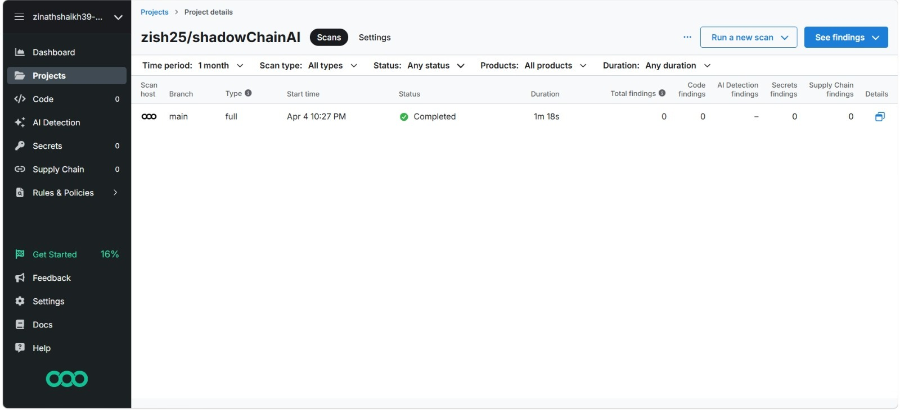

# ShadowChainAI


ShadowChainAI is a lightweight cybersecurity decision simulation project.
It models login events, computes a risk score from contextual and behavioral signals, selects a response action, and evaluates whether the response is appropriate.

## 🌐 Overview

ShadowChainAI simulates security login scenarios and applies a modular decision pipeline to estimate risk, select a defensive response, and evaluate the quality of that response.

## ✨ Key Features

- Modular risk pipeline that separates context, behavior, scoring, decision, and evaluation.
- Interpretable rules for time, location, failed logins, and file-access patterns.
- Lightweight, dependency-free Python setup for quick experimentation.
- Scenario-based execution for testing normal and suspicious activity patterns.

## 🧩 Features

- Simulates security events (login time, location, activity).
- Computes risk using modular risk components.
- Chooses defensive actions using threshold-based policy.
- Scores outcomes with reward and evaluation modules.
- Logs each episode for analysis.

## 🗂️ Project Structure

- `environment.py`: Core `SecurityEnv` environment with state reset, risk/reward logic, and `step(action)` flow.
- `context_intelligence.py`: Extracts contextual risk features (time and location).
- `behavior_analysis.py`: Extracts behavioral risk features (failed logins and file access).
- `risk_engine.py`: Combines context + behavior features into a final risk score.
- `decision_module.py`: Maps risk score to action (`allow`, `monitor`, `block`).
- `evaluation_module.py`: Compares chosen action against expected action.
- `logging_system.py`: In-memory episode logger.
- `inference.py`: End-to-end multi-scenario simulation runner.
- `test_env.py`: Quick scenario-based smoke tests for `SecurityEnv`.

## 🛡️ Security Response Model

### ⚙️ Action Space

Supported actions in the environment:

- `allow`
- `monitor`
- `block`
- `quarantine`

### 📊 Risk Heuristics

The environment currently uses simple, interpretable rules:

- Time risk:
  - Late night (`<6` or `>22`) adds high risk.
  - Outside office hours (`<9` or `>17`) adds moderate risk.
- Location risk:
  - Unknown locations add risk.
- Behavior risk:
  - Multiple failed logins add risk.
  - Excessive file access adds risk.

Final score is capped to `1.0`.

## 🔐 Security Validation

We integrated Semgrep for AI-powered static code analysis to detect vulnerabilities and validate the security posture of our system.

The scan results confirmed that the current codebase is free from known vulnerabilities, providing a secure foundation for our AI-driven risk detection and response pipeline.

This complements our behavioral risk scoring by adding a static security validation layer.

All modules were tested through multiple simulated scenarios, ensuring correct risk scoring and response behavior.

### 📸 Scan Results

Semgrep scan showing no detected vulnerabilities in the current codebase.



## 🎯 Why This Project

- Demonstrates how security decisions can be modeled as a clear and testable pipeline.
- Provides an interpretable baseline before moving to ML-based threat response systems.
- Helps validate incident-response logic with repeatable scenario simulations.

## 🧰 Setup and Requirements

- Python 3.9+
- No third-party dependencies required for current codebase

## 🚀 How to Run

From the project root:

```bash
python inference.py
```

Run environment smoke scenarios:

```bash
python test_env.py
```

You can also run direct environment tests:

```bash
python environment.py
```

## 🖥️ Demo Output

Example output from `python test_env.py`:

```text
=== Scenario 1: Normal Login ===
state: {'login_time': 9, 'location': 'office', 'activity': {'file_access': 3, 'failed_logins': 0}, 'risk_score': 0.0}
risk_score: 0.0
action: allow
reward: 1.0

=== Scenario 2: Suspicious Activity ===
state: {'login_time': 2, 'location': 'unknown', 'activity': {'file_access': 15, 'failed_logins': 5}, 'risk_score': 1.0}
risk_score: 1.0
action: block
reward: 1.0
```

Example output from `python inference.py`:

```text
=== Episode 1 ===
state: {'login_time': 10, 'location': 'office', 'activity': {'file_access': 3, 'failed_logins': 0}, 'risk_score': 0.0}
risk_score: 0.0
chosen action: allow
reward: 1.0
```

## 🔄 Example Pipeline

1. Initialize environment state with `env.reset()`.
2. Inject scenario conditions (time, location, activity).
3. Extract context and behavior features.
4. Calculate unified risk score.
5. Choose action from decision module.
6. Execute action in environment with `env.step(action)`.
7. Log and evaluate results.

## 🔭 Future Scope

### 📌 Next Improvements (Optional)

- Add unit tests with `pytest`.
- Add persistence (save logs to JSON/CSV).
- Replace rule-based policy with a trainable agent.
- Add CLI flags to run custom scenarios.
- Add visualization for risk trend and action distribution.

## 📄 License

Add a license file if you plan to share this publicly.

## 🧠 One-Line Summary

ShadowChainAI is a modular Python simulation that turns login context and behavior into risk-aware security actions and evaluation signals.
